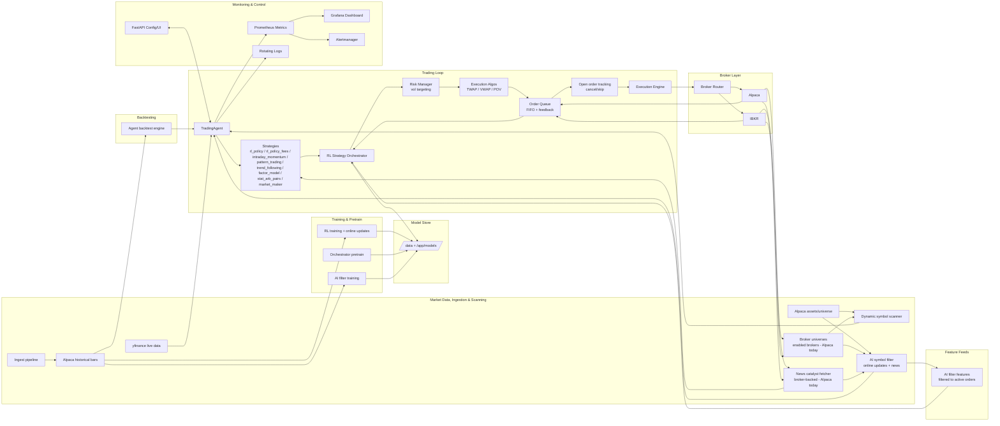

# Autotrader (Multi-Market)

Autotrader is an intraday trading agent for US and EU equities (NYSE, Nasdaq, Borsa Italiana). It combines multiple strategies, an RL-based orchestrator, broker adapters, risk controls, and monitoring into a Docker-first stack for live trading, backtesting, and continuous learning.

## Goals
- Trade intraday with configurable strategies and strict risk controls.
- Operate live or in backtest mode with shared core logic.
- Provide observability (Prometheus + Grafana) and operational controls (FastAPI UI).
- Support GPU acceleration where available, with CPU fallback.
- Be resilient to restarts via periodic state checkpoints.

## Repository Layout
- `app/`: core trading agent code
- `config/config.yaml`: all runtime configuration
- `docker/`: Dockerfiles (CPU + GPU)
- `grafana/`: Grafana provisioning + dashboard
- `prometheus/`: Prometheus scrape + alerting config
- `scripts/`: helper scripts
- `docs/`: subsystem documentation

## Architecture



## Core Components
### Trading Loop
- Entry point: `app/agents/trader.py`
- Resolves active symbols (static list or dynamic scanner/AI filter)
- Applies per-symbol venue gating and market-hours checks
- Runs strategies, orchestrator selection, and risk checks
- Submits orders via the execution engine and order queue
- Updates metrics and checkpointed state

### Strategies
- `rl_policy`: RL policy inference with optional GPU acceleration
- `rl_policy_fees`: fee-aware RL policy with broker fee guardrails
- `intraday_momentum`: price/volume threshold strategy
- `pattern_trading`: momentum breakout with filters and trailing exits
- `trend_following`: moving-average trend breakout
- `factor_model`: momentum + liquidity + volatility composite
- `stat_arb_pairs`: rolling correlation pair trading
- `market_maker`: inventory-skewed limit quoting

### Orchestrator
- RL-based strategy selection that consumes strategy signals and AI-filter features
- Records per-symbol decisions and updates on price movement + order feedback
- Checkpoints biases/models on an interval

### Execution
- `app/execution/executor.py`: broker-agnostic execution
- `app/execution/order_queue.py`: FIFO submission, broker feedback loop
- Open-order guardrails + cancel/replace logic
- Optional TWAP/VWAP/POV slicing for larger orders

### Data & Scanning
- Live data from yfinance in trade mode
- Historical bars from Alpaca for training/backtesting/ingestion
- Dynamic scanner and AI filter for symbol selection
- News catalyst support (Alpaca news)

### Learning
- Offline RL training and online updates
- GPU acceleration if available
- Best-model selection via `learning.use_best_model`

### Monitoring & API
- Prometheus metrics (`app/monitoring/metrics.py`)
- Grafana dashboards for orders, positions, PnL, and account status
- FastAPI `/health`, `/config`, `/config/update`, `/restart`, `/ui`

### Resilience & Storage
- Periodic checkpoints for trader/learner state (`checkpointing.*`)
- Retention pruning by age and count to avoid disk growth

## Configuration Overview
All configuration lives in `config/config.yaml`.

Key sections:
- `market.*`: venue gating, hours, symbol venue mapping
- `data.*`: symbols, dynamic scan, sources, AI filter
- `news.*`: catalyst fetch config (optional `news.llm.*` for Ollama gating; default base_url `http://ollama:11434`)
- `strategy.*`: strategy selection and params
- `orchestrator.*`: RL orchestrator settings
- `risk.*`: risk limits, stops, cool-downs
- `execution.*`: order handling and open-order guard
- `learning.*`: RL training and online updates
- `backtest.*`: backtest range and engine settings
- `monitoring.*`: metrics and alerts
- `checkpointing.*`: checkpoint cadence + retention
- `kill_switch.*`: manual interlocked kill switches (sleep or liquidation)
- `reports.daily_top_movers.*`: daily top movers report + training exports

See `docs/configuration.md` for full details.

## Daily Reporting
Daily top movers reporting runs after each market close, emails a summary, and stores intraday 1-minute
bars for the top performers. The report includes numeric indicators, signal hints, and optional news
correlation for each top mover.
The email body is also saved locally under `/data/reports/daily_top_movers/<YYYY-MM-DD>/_email/`.
If a symbol has no trades and no skip metrics, the report will infer a reason such as
`not_in_active_universe`, `open_order_pending`, `held_position_no_trade`, or `no_signal_or_filtered`.

Key config under `reports.daily_top_movers.*`:
- `feed` (iex or sip)
- `signal_thresholds.*` (early momentum / volume / runup / drawdown)
- `news.*` (headlines + correlation hints)
- `email.*` (SMTP overrides; `smtp_require_tls` can disable STARTTLS)

## Safeguards
- Market-hours gating by venue
- Per-symbol venue mapping (manual + broker refresh)
- Risk manager limits (loss caps, exposure, leverage)
- Cool-down windows and stop logic
- Fee-aware guardrails for RL strategy
- Rolling strategy performance report and kill switch thresholds (`strategy.performance.*`)
- Open-order guard and order-queue serialization

## Quick Start (Docker)
1) Copy env template:

```bash
cp .env.example .env
```

2) Set broker credentials in `.env`:
- `ALPACA_API_KEY`
- `ALPACA_API_SECRET`

3) Start services:

```bash
docker compose up -d --build
```

4) Verify:
- API health: `http://localhost:18083/health`
- Config UI: `http://localhost:18083/ui`
- Grafana: `http://localhost:3003`
- Healthwatch metrics: `http://localhost:9105/metrics` (internal in Docker; use Prometheus to view)

Services:
- `trader`: live trading loop
- `api`: FastAPI config/health/UI
- `prometheus`, `grafana`, `alertmanager`: monitoring
- `calendar-updater`: weekly market holidays refresh
- `tests-when-closed`: runs tests/backtests when markets are closed
- `healthwatch`: health probes + Prometheus metrics
- `daily-report`: daily top movers email + training data export

## Common Commands
Download data:
```bash
docker compose run --rm trader python3 -m app.main download --config /app/config/config.yaml --symbols AAPL MSFT
```

Backtest:
```bash
docker compose run --rm trader python3 -m app.main backtest --config /app/config/config.yaml
```

Train RL policy:
```bash
docker compose run --rm trader python3 -m app.main train --config /app/config/config.yaml
```

Evaluate:
```bash
docker compose run --rm trader python3 -m app.main evaluate --config /app/config/config.yaml
```

## Documentation
- `docs/README.md` for the full index
- Subpages cover: AI filter, trading loop, strategies, execution, risk, brokers, backtesting, data, learning, API, monitoring, configuration


## History

Recent changes (newest first):
- Added daily top movers report with email + training data export.
- Added manual kill switches for force sleep and force liquidation with interlock.
- Added healthwatch scheduler heartbeat logging.
- Enabled healthwatch market-based stack sleep/wake in config.
- Fixed market-based sleep/wake scheduling to use timezone-aware UTC timestamps.
- Added optional healthwatch market-based stack sleep/wake control.
- Added explicit logs when news catalyst refresh starts/completes.
- Made news catalyst refresh async so the trader keeps running while Ollama updates.
- Added a separate Grafana dashboard for strategy performance metrics.
- Added Grafana stat panel for 24h PDT blocks.
- Added Grafana panel for PDT blocks (day-trading protection).
- Added rolling strategy performance reporting and kill switch thresholds.
- Added PDT-protection block counter for broker-rejected orders.
- Run Ollama as a docker service for news LLM gating.
- Added optional Ollama-based LLM gate for news catalysts (disabled by default).
- Fixed live lookback slicing to use bars-per-day instead of raw days count.
- Added multi-broker live market data provider support (alpaca/ibkr) with routing.
- Switched live market data provider to Alpaca (batch bars) with optional yfinance fallback.
- Added Grafana table for strategy selection counts.
- PnL% now uses broker-reported last_equity when available, otherwise start equity.
- PnL% and drawdown metrics now track equity vs start/peak instead of staying at zero.
- Switched Open Orders panel to instant view to avoid stale series.
- Aligned Open Orders Grafana panel to show last 5 minutes to match pending orders view.
- Switched dynamic symbol price caps to use buying power and exposed buying power metrics.
- Capped dynamic symbol list size to the tradeable universe count (plus positions/open orders).
- Raised dynamic_symbols.max_symbols to 50000 to allow the full active universe.
- Enforced cash-aware symbol filtering to cap candidates by available cash and always include open-order symbols.
- Added flow diagrams for the trading agent (dev).
- Switched orchestrator to direct mode (single strategy selection) using all strategy signals.
- Tweaked broker market status panel to show only current status (no history).
- Added Grafana broker market status panel and broker_market_open metric.
- Adjusted Grafana active symbol panels to show only active (value=1) series.
- Capped AI-filter symbol list to dynamic_symbols.max_symbols to prevent oversized active symbol metrics.
- Fixed yfinance downloads by only passing proxy when configured.
- Guarded factor model and AI filter features against zero prices to avoid divide warnings.
- Guarded intraday momentum strategy against zero prices during backtests.
- Added production strategy set (trend, factor, stat-arb, market making) with execution algos and vol targeting.
- Added limit-order support for brokers and time-sliced order queue scheduling.
- Added tests for strategy models and execution algos.
- Cleared stale active-symbol metrics so Grafana only shows current symbols.
- Ensured held positions stay in dynamic symbols even when scanner filters exclude them.
- Raised minimum trade price to 2.0 across dynamic scanning and pattern selection.
- Added universe price filtering by cash-aware price bounds for dynamic symbols.
- Added Grafana panel for broker API call activity.
- Fixed Mermaid label text so the architecture diagram renders in master.
- Ensured dynamic universe always keeps positions/orders and hardened broker-backed news fetching.
- Fixed architecture diagram to show broker-backed news inputs.
- Fixed OrderQueue snapshot response handling so tests pass.
- Updated the architecture diagram to show broker-backed news and broker universe inputs.
- Added broker-backed news catalysts and a broker-aware universe option for AI symbol filtering.
- Added multi-broker routing with broker-aware metrics, backtest support, and config/UI updates.
- Verified healthwatch metrics and sent test alert via Alertmanager.
- Restarted healthwatch after fixing targets config.
- Rebuilt dev stack with healthwatch/autoheal and resolved API port conflict.
- Rebuilt and restarted live stack with healthwatch/autoheal.
- Added healthwatch + autoheal with alerts for service restarts.
- Rebuilt and restarted live stack to restore trader service.
- Restructured README and docs into a progressive guide with new ops/testing/deploy pages.
- Rebuilt dev tests image and re-ran pytest (13 passed, 14 warnings).
- Re-ran pytest after checkpoint fix (13 passed, 14 warnings).
- Ran dev pytest after checkpoint tests (10 passed, 14 warnings).
- Ran pytest after adding checkpoint tests (10 passed).
- v2.0 backtest failed before rebuild; image needs refresh after orchestrator guard.
- Guarded RL orchestrator price update against zero/invalid prices after backtest failure.
- Started v2.0 backtest run (in progress).
- Added checkpointing with retention for trader/learner state to resume across reboots.
- Waiting on v2.0 training completion (in progress).
- v2.0 training still running after extended wait.
- Monitoring v2.0 training run (in progress).
- Started v2.0 training run (in progress).
- Rebuilt and redeployed the dev stack with scalping settings.
- Rebuilt and redeployed the live stack with scalping settings.
- Ran pytest with warnings output (10 passed, 4 warnings).
- Applied scalping-oriented configuration defaults (tighter stops, faster cadence).
- Rebuilt and redeployed the live stack to apply symbol venue refresh.
- Added automatic Alpaca symbol-to-venue refresh for per-symbol market gating.
- Rebuilt and restarted the live stack after adding per-symbol venue gating.
- Added per-symbol venue gating to prevent orders when a symbol’s market is closed.
- RL orchestrator sweep running in dev (in progress).
- Orchestrator sweep rerun requested after image refresh.
- Orchestrator sweep now falls back to backtest CSV symbols when data.symbols is empty.
- Updated orchestrator sweep script to use RL orchestrator settings.
- Aligned orchestrator documentation with the RL implementation and marked legacy sweep usage.
- Enabled backtest.run_when_closed and restarted tests-when-closed.
- Rebuilt and restarted all services to apply the latest configuration.
- Rebuilt tests-when-closed to include backtest runner support.
- tests-when-closed now runs backtests when configured in backtest.run_when_closed.
- Ran pytest in the tests-when-closed container (10 passed).
- Dynamic backtest symbols now fall back to CSV data when symbols are empty.
- Added backtest plan sampling with local news support plus robustness/unit tests.
- Stopped the dev stack after publishing v2.0 release.
- Rebuilt and restarted the v2.0 stack after fixing trader startup crash.
- Fixed trader startup crash by initializing broker name before the order queue.
- Started a long-running v2.0 RL training run (in progress).
- Rebuilt the dev stack after enforcing GPU usage.
- Rebuilt and restarted the v2.0 stack after enforcing GPU usage.
- Enforced GPU usage for ML/RL components when CUDA is available.
- Started a long-running dev RL training run (in progress).
- Rebuilt the dev stack after RL training guard fix.
- Rebuilt and restarted the v2.0 stack after RL training guard fix.
- Guarded RL training against empty/short datasets to prevent index errors.
- Adjusted dev docker-compose ports to avoid conflicts and rebuilt the dev stack.
- Rebuilt and restarted the full v2.0 stack after orchestrator/backtest hardening.
- Hardened backtests against live data calls and disabled on-demand AI feature fetches in the orchestrator by default.
- Ignored dev worktree artifacts and cleaned up transient log/output files.
- Removed unused orchestrator config parameters now that the RL orchestrator is standard.
- Aligned AI/RL objectives with time-penalized return for faster equity growth.
- Updated architecture diagram to show AI filter features feeding the orchestrator.
- Enriched order feedback with broker status and fill metrics for the RL orchestrator.
- Updated architecture diagram to include the order queue and broker feedback loop.
- Added an order queue layer that serializes broker submissions and feeds order responses into the RL orchestrator.
- Replaced the orchestrator with an RL-based version that incorporates AI filter inputs for actionable symbols.
- Added documentation subpages per subsystem in `docs/`.
- Added pytest-based test suite and a market-closed test runner service.
- Fixed AI filter bar mapping for single-symbol responses; corrected backtest session prev-close handling.
- Updated learner lock logs to reflect idle behavior.
- Kept inactive learner in a sleep loop instead of exiting to avoid restart churn.
- Added learner lock heartbeats during training/sleep to prevent CPU/GPU contention.
- Enforced exclusive learner execution with GPU preference for online training.
- Added AI filter device logging for GPU/CPU confirmation.
- Enabled GPU acceleration for the AI symbol filter when CUDA is available.
- Fixed trader loop indentation regression causing container restarts.
- Updated architecture diagram to show AI filter ingesting news.
- Added news-aware features to the AI symbol filter.
- Synced news refresh to 1 minute to match AI filter cadence.
- Added logging for news catalyst cache refreshes.
- Increased AI filter online update steps and max symbols for continuous training.
- Updated architecture diagram to reflect AI filter, ingestion, and online updates.
- Enabled online updates for the AI symbol filter (incremental retraining on refresh).
- Increased AI filter cadence to 1 minute and raised universe cap for live scanning.
- Added a pre-run log for the AI filter so execution is visible immediately.
- Added AI filter heartbeat logging every 30s after a successful run.
- Added logging when the AI symbol filter runs so live usage is visible in logs.
- Ported dev run artifacts (backtest and ingest outputs) into v2.0 for traceability.
- Added Alpaca ingestion support to load a full universe when symbols are omitted; added saved backtest case configs.
- Promoted the AI dynamic symbol filter into the live branch for v2.0.
- Fixed open-order Prometheus gauges to remove stale labels so Grafana shows only current pending orders.
- Added strategy-level pending-order guard to skip signal evaluation while orders are open.
- Added pending-order cancel/replace logic and broker order cancellation support.
- Forced Grafana to reload provisioned dashboards for consistent axis autoscaling.
- Added AI-driven symbol scoring for full Alpaca US universe selection in dev.
- Added portfolio position metrics and Grafana table panels for holdings and pending orders.
- Ensured held positions are always evaluated and prevented short sells when no long position.
- Deployed combined RL strategies (`rl_policy` + `rl_policy_fees`) and isolated dynamic symbol lists per strategy.
- Added Alpaca historical ingestion for multi-year 5m data and wired ML orchestrator pretrain to use Alpaca data.
- Added agent-aligned backtest engine so the real trading loop (strategy + orchestrator + risk + execution) is tested.
- Added ML orchestrator (LSTM default) with online training, best-model checkpointing, and out-of-band pretraining.
- Added dynamic symbol scanning with cash-aware caps and fallback filters.
- Added web UI config editor and Grafana dashboards for active broker, strategies, orders, and account metrics.

Highest positive impact (testing/live trading):
- RL-only strategy in agent backtest: +25.76% return, 12 trades on the full-year run.
- Dual RL strategies with per-strategy symbol lists: +56.20% return in short-window dynamic-symbol tests.
- Best-model loading for RL (`learning.use_best_model: true`) keeps the highest-evaluated model in live runs.
