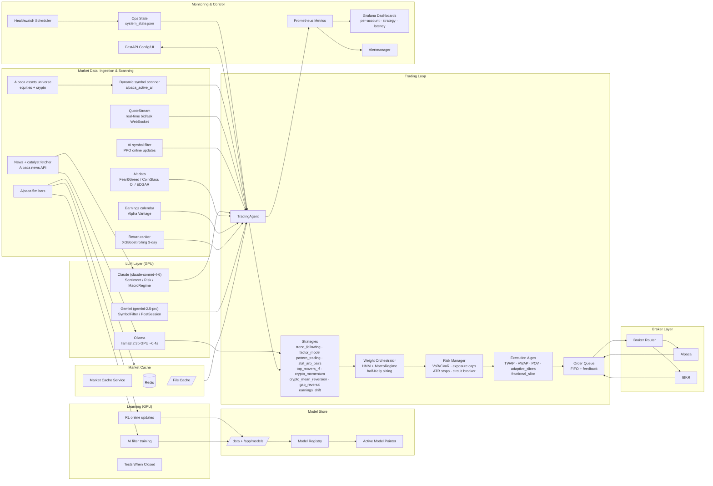

<!-- SPDX-License-Identifier: AGPL-3.0-or-later -->
<!-- Copyright (c) 2025-2026 Nicola Vittorio Francesconi, AKA ilfrick -->

# Fricktrade (Multi-Market)

Fricktrade is an automated trading agent for US equities (NYSE, Nasdaq) and crypto (24/7 via Alpaca). It combines multiple signal-generating strategies, LLM-driven analysis, a portfolio optimizer, broker adapters, layered risk controls, and monitoring into a Docker-first stack for live paper/live trading, backtesting, and continuous learning.

## Goals
- Trade equities intraday and crypto 24/7 with configurable strategies and strict risk controls.
- Fractional share support: crypto always, equities configurable (`trading_limits.fractional_shares`).
- Operate live or in backtest mode with shared core logic.
- LLM-augmented decisions: Claude for sentiment/risk/macro, Gemini for symbol selection and session grading.
- Provide observability (Prometheus + Grafana) and operational controls (FastAPI UI).
- Support GPU acceleration where available, with CPU fallback.
- Be resilient to restarts via periodic state checkpoints.

## Repository Layout
- `app/`: core trading agent code
- `config/config.yaml`: all runtime configuration
- `docker/`: Dockerfiles (CPU + GPU)
- `grafana/`: Grafana provisioning + dashboards (per-account dashboards auto-generated from `.env`)
- `prometheus/`: Prometheus scrape + alerting config
- `scripts/`: helper scripts (see `scripts/README.md`)
- `docs/`: subsystem documentation (see `docs/STATUS.md` for current status)

## Architecture



## Core Components

### Trading Loop
- Entry point: `app/agents/trader.py`
- Resolves active symbols (dynamic scanner/AI filter; both equities and crypto derived from Alpaca)
- Applies per-symbol venue gating: equities only when NYSE/Nasdaq open; crypto 24/7
- Runs strategies, weight orchestration, and layered risk checks
- Submits orders via the execution engine and order queue
- Updates Prometheus metrics and checkpointed state
- `risk.enabled` can bypass risk checks, but broker account flags still block orders

### Strategies (active, 9 total)
- `trend_following`: Supertrend + VWAP deviation + RSI(14) gate + volume confirmation + regime crisis block
- `factor_model`: Hurst-adaptive weighting, stochastic + CCI, ROC momentum, mean-reversion quality gate
- `pattern_trading`: chart pattern breakout with 2×ATR adaptive stop + partial take-profit + trailing exits
- `stat_arb_pairs`: log-ratio spread, ADF cointegration test, OLS hedge ratio, z-score entry (z=2.0)
- `top_movers_rf`: same-day top-mover random-forest nowcast + intraday low-zone entry scoring
- `crypto_momentum`: crypto-specific trend + RSI + volume filters; 24/7 via Alpaca GTC orders
- `crypto_mean_reversion`: Bollinger/VWAP mean-reversion for crypto; 24/7 via Alpaca
- `gap_reversal`: equity gap-up/down reversal (9:35–10:30 ET window, volume + RSI filter)
- `earnings_drift`: Post-Earnings Announcement Drift (PEAD) — gap ≥5% + volume ≥1.5× after earnings

Signals are weighted (`confidence × strategy_weight`) and combined; `min_conviction` threshold (default 0.3) filters low-confidence actions. A bin-based `ConfidenceCalibrator` (per-strategy, 200-sample warm-up) transforms raw confidence to calibrated probability.

Disabled by default: `rl_policy`, `rl_policy_fees`, `intraday_momentum`, `market_maker`.

### Orchestrator
- Weight-based signal combination (`orchestrator.mode: weights`) using configurable `strategy_weights`
- Weights adjusted by HMM regime (3-state: low_vol_trending / medium / high_vol_crisis) and `MacroRegimeAnalyzer` (FRED VIX/DGS10/DXY + Claude, 4h TTL cache)
- Half-Kelly position sizing: `max_pos_pct × (2p−1) × 0.5` from calibrated win probability
- RL orchestrator wired but disabled (`orchestrator.rl.enabled: false`) pending convergence work

### Execution
- `app/execution/executor.py`: broker-agnostic; auto-upgrades market → limit at mid-price when spread available
- `app/execution/order_queue.py`: FIFO submission, broker feedback loop, daily retry budget reset
- `app/execution/algos.py`: TWAP / VWAP / POV slicing + `adaptive_slices()` (regime-aware: 2× slices in crisis)
- `SmartOrderRouter`: Almgren-Chriss impact model selects algo; legacy fallback available
- TCA feedback: per-symbol EWMA slippage penalty reduces size up to 50%, decays 0.9×/day
- Fractional orders: `qty < 1` routed as a single `fractional_slice`, bypassing TWAP splitting
- Supports both whole-share (equities) and fractional (crypto always, equities via `trading_limits.fractional_shares`)

### Data & Scanning
- Primary live data: `data.provider: alpaca` (5m bars via Alpaca REST); yfinance as fallback
- Market cache: Redis + file, staleness-controlled (`max_age_multiplier`, `ignore_staleness: false`)
- Universe: `alpaca_active_all` — both US equities and crypto derived live from Alpaca `get_all_assets()`; no hardcoded symbol lists. Capped at `max_symbols: 150` after AI filter
- Both accounts (`alpaca:Realistic`, `alpaca:Higher`) evaluate the full 150-symbol universe; `_size_order` scales position size to each account's equity (`buying_power_scaling: false`)
- Real-time bid/ask via `QuoteStream` (`app/data/quote_stream.py`) — alpaca-py WebSocket; injects `spread_pct` and `microprice` into market_state
- News catalyst: Alpaca news API → **Ollama GPU** (llama3.2:3b, ~0.4s/inference on GTX 1060); Claude for per-symbol sentiment (15-min cache)
- Alternative data: Fear & Greed Index (alternative.me), CoinGlass open interest (crypto), SEC EDGAR insider trades
- Earnings calendar: Alpha Vantage CSV, daily refresh, `earnings_window` (pre/post/none) injected per-symbol
- Return-ranker: XGBoost model trained on rolling 3-day window of live features + next-day returns

### GPU Allocation
The GTX 1060 (6 GB VRAM) is allocated as follows:

| Workload | Container | VRAM | Notes |
|----------|-----------|------|-------|
| Ollama (llama3.2:3b) | `ollama` | ~2.7 GB | Primary beneficiary — 15–25× speedup over CPU; CUDA_VISIBLE_DEVICES=0 |
| RL online training | `learner` | ~50–100 MB | Secondary; runs when market is closed |
| AI filter (PPO) | `trader` | ~15–20 MB | Tiny model; GPU re-enabled Feb 2026 |
| Remaining headroom | — | ~3.1 GB | Buffer prevents OOM |

GPU enable/disable state persists in `/data/gpu_state.json`. Use `scripts/enable_gpu.sh` to re-enable after OOM.

### Learning
- Offline RL training and online updates via `learner` container
- GPU acceleration if available; CUDA errors disable GPU via `gpu_state.json` until manually re-enabled
- Best-model selection via `learning.use_best_model`
- Model registry snapshots and drift monitoring with auto rollback

### Monitoring & API
- Prometheus metrics (`app/monitoring/metrics.py`)
- Grafana dashboards: per-account overview, strategy performance, latency (auto-generated from `.env`)
- FastAPI `/health`, `/config`, `/config/raw`, `/config/schema`, `/config/update`, `/restart`, `/ui`
- Optional API auth via `api.auth.*` using `X-API-Key` or `Authorization: Bearer`
- Audit and compliance logs (JSONL/CSV) for decision traces

### Resilience & Storage
- Periodic checkpoints for trader/learner state (`checkpointing.*`)
- Retention pruning by age and count to avoid disk growth
- `autoheal` container restarts failed services automatically; `healthwatch` gates trading by market hours

## Configuration Overview
All configuration lives in `config/config.yaml`. `.env` values are only used when referenced via `${ENV_VAR}` interpolation or by services that read `.env` directly (e.g. Alertmanager SMTP rendering).

Key sections:
- `api.*`: FastAPI auth controls
- `market.*`: venue gating, hours, symbol venue mapping (NYSE / Nasdaq / Crypto)
- `brokers.*`: broker credentials and adapters; supports `brokers.<name>.accounts[]` or env auto-detect for multi-account routing
- `data.*`: symbols (empty for live; dynamic scanner fills), dynamic scan, AI filter, interval, lookback
- `data.dynamic_symbols.universe: alpaca_active_all`: equities + crypto from Alpaca (no hardcoded lists)
- `market_cache.*`: Redis + file cache settings; `ignore_staleness: false`, `max_age_multiplier: 6`
- `news.*`: catalyst fetch config; `news.llm.*` for Ollama gating (default `http://ollama:11434`)
- `strategy.*`: strategy selection, params, and per-strategy weights
- `orchestrator.*`: weight-based or RL mode; `strategy_weights` per strategy
- `risk.*`: risk limits, crypto limits, stops, cool-downs, exposure caps (venue/sector)
- `execution.*`: order handling, limit orders, algo slicing, smart router, open-order guard
- `execution.brokers.routing.buying_power_scaling: false`: both accounts evaluate full universe; `_size_order` scales qty to each account's equity
- `trading_limits.*`: `fractional_shares`, `min_notional`, `min_price`, `allow_shorts`
- `llm.*`: Claude/Gemini backends, daily budget, sentiment / macro_regime / risk_interpreter / symbols_filter / meta_orchestrator
- `alt_data.*`: fear_greed, coinglass, sec_edgar, alpha_vantage toggles and keys
- `fred.*`: FRED API key + base URL for VIX / DGS10 / DXY macro data
- `quote_stream.*`: real-time bid/ask WebSocket toggle
- `portfolio.rebalance.*`: drift-threshold rebalancing engine
- `learning.*`: RL training and online updates
- `backtest.*`: backtest range, engine settings, walk-forward windows
- `monitoring.*`: metrics and alerts
- `checkpointing.*`: checkpoint cadence + retention
- `kill_switch.*`: manual interlocked kill switches (sleep or liquidation)
- `reports.daily_top_movers.*`: daily top movers email + training data export

See `docs/STATUS.md` for current implementation status and remaining roadmap.

## Daily Reporting
Daily top movers reporting runs after each market close, emails a summary, and stores intraday 1-minute bars for the top performers. The report includes numeric indicators, signal hints, and optional news correlation for each top mover. The email body is also saved locally under `/data/reports/daily_top_movers/<YYYY-MM-DD>/_email/`.

Alertmanager SMTP and recipient settings are configured via `.env` and rendered into a local-only Alertmanager config file (do not commit secrets). See `.env.example` for the required keys.

## Safeguards
- Market-hours gating by venue (equities gated; crypto 24/7)
- Per-symbol venue mapping (manual + broker auto-refresh)
- Risk manager: loss caps, exposure caps (NYSE/Nasdaq 60%, Crypto 40%, per-sector limits), leverage ceiling
- VaR/CVaR gating and sector/venue concentration limits
- Per-symbol circuit breaker (5% unrealized loss blocks that symbol)
- PDT retry suppression: tracks day-trade round-trips per broker/symbol
- Pending notional race prevention: atomic reserve before enqueue, release on terminal response
- Two-phase dispatch: exit orders complete before new entry orders begin
- Time-of-day scaling: blocks at open (9:30–9:35 ET) and close (15:55–16:00 ET), 50% at lunch; crypto 70% at 00–04 UTC
- Open-order guard and order-queue serialization

## Quick Start (Docker)

1) Copy env template:
```bash
cp .env.example .env
```

2) Set credentials in `.env`:
- `ALPACA_API_KEY`, `ALPACA_API_SECRET` — required (paper or live)
- `ANTHROPIC_API_KEY` — required for Claude sentiment / risk interpreter / macro regime
- `GOOGLE_GEMINI_API_KEY` — required for Gemini symbol filter and post-session analyst
- `FRED_API_KEY` — optional; MacroRegimeAnalyzer falls back to yfinance `^VIX` without it
- `ALPHA_VANTAGE_API_KEY` — optional; EarningsDriftStrategy uses no-signal fallback without it
- `COINGLASS_API_KEY` — optional; CoinGlass OI skipped without it
- `FRICKTRADE_API_TOKEN` — optional (only if `api.auth.enabled`)

3) Start services:
```bash
./scripts/compose_up.sh
```
This auto-detects GPU and starts with `docker-compose.gpu.yml` overlay if available, falling back to CPU otherwise. Per-account Grafana dashboards are generated automatically from `.env`.

4) Verify:
- API health: `http://localhost:18081/health`
- Config UI: `http://localhost:18081/ui`
- Grafana: `http://localhost:3002`

**Services:**

| Service | Purpose |
|---------|---------|
| `trader` | Live trading loop (GPU for AI filter + RL) |
| `learner` | RL online training updates (GPU) |
| `ollama` | Local LLM gate — llama3.2:3b on GPU (~0.4s/call) |
| `api` | FastAPI config/health/UI |
| `market-cache` | Redis-backed Alpaca bar cache |
| `redis` | In-memory cache store |
| `prometheus` / `grafana` / `alertmanager` | Monitoring stack |
| `calendar-updater` | Weekly market holidays refresh |
| `tests-when-closed` | Runs pytest + backtests when market is closed |
| `healthwatch` | Health probes + market-based sleep/wake scheduler |
| `autoheal` | Auto-restart on health failure |
| `docker-socket-proxy` | Isolated Docker socket for healthwatch/autoheal |
| `daily-report` | Daily top movers email + training data export |

## Common Commands

Download data:
```bash
docker compose run --rm trader python3 -m app.main download --config /app/config/config.yaml --symbols AAPL MSFT
```

Backtest:
```bash
docker compose run --rm trader python3 -m app.main backtest --config /app/config/config.yaml
```

Walk-forward backtest:
```bash
python3 scripts/benchmark_runner.py --config config/config.yaml --walk-forward
```

Train RL policy:
```bash
docker compose run --rm trader python3 -m app.main train --config /app/config/config.yaml
```

Re-enable GPU after OOM:
```bash
./scripts/enable_gpu.sh
```

## Documentation
- `docs/STATUS.md` — current implementation status, remaining roadmap, cron jobs, API keys
- `scripts/README.md` — all operational scripts with usage examples
- `AGENTS.md` — full commit-by-commit implementation history and architectural patterns
- `docs/`: subsystem detail pages (AI filter, strategies, execution, risk, brokers, backtesting, monitoring)

## License
This project is licensed under the GNU Affero General Public License v3.0 (AGPLv3). See `LICENSE`.
Third-party attributions are in `THIRD_PARTY_NOTICES.md`.

## History

See `AGENTS.md` for the full implementation history. Below are the major milestones:

- **GPU allocation** (2026-03-01): Ollama (llama3.2:3b) moved to GPU — primary beneficiary (15–25× speedup, 7s→0.4s/inference). Root cause of repeated Ollama exits identified: `docker-compose.gpu.yml` was mounting `/dev/nvidia*` into Ollama with `CUDA_VISIBLE_DEVICES=""` (empty string, ambiguous to CUDA) causing the CUDA runner to crash on startup. Fixed with `CUDA_VISIBLE_DEVICES=0`. Trader GPU re-enabled (had been disabled by OOM on Feb 24). `OLLAMA_KEEP_ALIVE=24h` and healthcheck added.

- **Symbol universe from broker** (2026-03-01): `load_universe("alpaca_active_all")` fetches both US equities and crypto from Alpaca `get_all_assets()`. Dead hardcoded `data.crypto_symbols` config removed. `buying_power_scaling: false` so both accounts evaluate the full 150-symbol universe. `filter_universe_by_price` bypasses the equity price check for crypto symbols.

- **Fractional trading** (2026-03-01): `_size_order` now returns `float` qty. `fractional_slice()` bypasses TWAP for sub-1-share orders. `cap_symbols_by_cash` and `price_max` universe cap both skipped when `fractional_shares: true`. `min_notional` guard ($1) replaces `allowed_value < last_price` guard. Crypto symbols always fractional (contain "/"); equities controlled by `trading_limits.fractional_shares`.

- **Complete implementation** (2026-03-01): `MacroRegimeAnalyzer` (FRED+Claude), `EarningsDriftStrategy` (PEAD), alt_data module (Fear&Greed / CoinGlass / EDGAR), `QuoteStream` (alpaca-py WebSocket), `adaptive_slices()` regime-aware TWAP, walk-forward backtesting with embargo gap, `RiskEventInterpreter` wired into `_handle_drift()`, LLM symbol filter hooked into `SymbolManager`, `RebalanceEngine`. `collect_crypto_training_data.py` hourly cron.

- **Crypto 24/7** (2026-02-28): `crypto_momentum`, `crypto_mean_reversion`, `gap_reversal` strategies. Alpaca GTC orders for crypto. 24/7 loop (equity market closed → filter to crypto symbols only). Per-venue exposure caps (Crypto 40%). `symbol_venue()` returns "Crypto" for any symbol containing "/".

- **LLM integration** (2026-02-28): `app/llm/` package — Claude backends (sentiment, risk_interpreter, macro_regime, meta_orchestrator) and Gemini backends (symbols_filter, post_session_analyst). Daily budget circuit breaker ($5 default). Raw article pipeline for sentiment context. `OLLAMA_KEEP_ALIVE=24h`.

- **Multi-session fixes** (2026-02-28): `stat_arb_pairs` root cause fixed (class-level shared price cache across symbol instances). `regime_probability` emitted in trace. `factor_model` weight ×0.9 in low_vol_trending. `risk_block_detail` in trace. Calibrator warm-up raised 0.5→0.75.

- **Return ranker** (2026-02-28): XGBoost return-ranker trained on rolling 3-day window; `max_age_days: 3` config. LLM catalyst (Ollama) added to `fetch_news_features()`. Alpaca news chunking (50 symbols/chunk). Rolling-window training with empty CSV cleanup.

- **Strategy overhaul** (2026-02-16): ~30-indicator injection via `compute_all_indicators()`; trend_following (Supertrend+VWAP), factor_model (Hurst-adaptive), stat_arb_pairs (ADF+OLS); `ConfidenceCalibrator`; regime-aware weight adjustments; `SmartOrderRouter`; TCA feedback loop; `PortfolioOptimizer` (risk_parity); half-Kelly sizing; ATR stops; limit orders default; `adaptive_slices()`.

- **Code review** (2026-02-13 to 2026-02-16): 19 concurrency/safety issues fixed. `datetime.utcnow()` fully migrated to timezone-aware. Per-symbol circuit breaker (was account-level 3%→per-symbol 5%). PDT retry suppression. Two-phase dispatch (exits before entries). Pending notional race prevention. Regime detection under lock. Narrow exception handling. `RiskManager` timezone-aware daily reset. `OrderQueue` FIFO stability + retry budget reset.

- **v3.0 foundation** (2026-02-01 to 2026-02-13): Extracted modules (`symbol_manager`, `performance`, `open_orders`, `account_metrics`). `PortfolioOptimizer` (risk_parity). Exposure caps. `RewardConfig`. Entry-only guards. `_is_closing_position` early computation. Dead code removal (`pipeline.py`, `market_state.py`). Persistent `ThreadPoolExecutor`. Docker socket proxy for healthwatch/autoheal. Dynamic Grafana dashboard generation per account.

- **v2.0** (2025–2026): RL orchestrator (PPO). AI symbol filter with online updates. Multi-broker routing (Alpaca + IBKR). Agent-aligned backtest engine. Model registry + drift detection + auto-rollback. VaR/CVaR, exposure caps, kill switch profiles. Audit/compliance logs. Healthwatch market-based sleep/wake. Daily top movers report with email. Per-symbol venue gating. Alpaca 5m bar ingest.

---

Backtest baseline (v3.0, Jan–Feb 2025, 15 symbols, $100k): −0.55%, 8 round trips, 38% win rate.
Walk-forward validation: `python3 scripts/benchmark_runner.py --walk-forward`.
RL orchestrator disabled pending convergence work; rule-based weight mode is the current production path.
