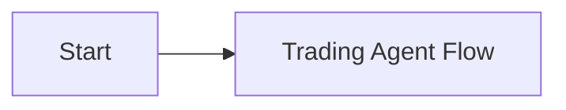

<!-- SPDX-License-Identifier: AGPL-3.0-or-later -->
<!-- Copyright (c) 2025-2026 Nicola Vittorio Francesconi, AKA ilfrick -->

# Autotrader Documentation

Graphic index:

Start here if you are new:
- `getting-started.md`
- `configuration.md`
- `testing.md`
- `deployment.md`
- `operations.md`
- `troubleshooting.md`

Subsystem reference:
- `trading-loop.md`
- `strategies.md`
- `strategy_models.md`
- `flow_trading_agent.md`
- `execution.md`
- `risk.md`
- `brokers.md`
- `data.md`
- `ai-symbol-filter.md`
- `learning.md`
- `backtesting.md`
- `monitoring.md`
- `api.md`
