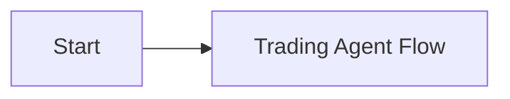

<!-- SPDX-License-Identifier: AGPL-3.0-or-later -->
<!-- Copyright (c) 2025-2026 Nicola Vittorio Francesconi, AKA ilfrick -->

# Fricktrade Documentation

## Getting Started

| Document | What you'll learn |
|----------|-------------------|
| [Getting Started](getting-started.md) | First-time setup, credentials, and running your first backtest |
| [System Map](system_map.md) | Architecture overview — what each module does and how they connect |
| [Configuration](configuration.md) | Every config key explained, with common toggles and examples |
| [Deployment](deployment.md) | Docker setup, GPU detection, and production deployment |

## How the System Works

| Document | What you'll learn |
|----------|-------------------|
| [Trading Loop](trading-loop.md) | The core trading cycle: symbols, signals, risk, execution |
| [Flow Diagrams](flow_trading_agent.md) | Visual flowcharts for the trading loop, orchestrator, execution, and exit logic |
| [State Transitions](agent_state_transitions.md) | Runtime state machines for trader, healthwatch, learner, and tests |
| [Strategies](strategies.md) | Active strategies (trend, factor, pattern, stat-arb), their filters, and how signals combine |
| [Strategy Models](strategy_models.md) | Production defaults: what each strategy computes and what it outputs |
| [Execution](execution.md) | Order queue, TWAP/VWAP/POV algos, retry policy, pending notional |
| [Risk](risk.md) | Risk limits, stops, circuit breaker, VaR, exposure caps |
| [Brokers](brokers.md) | Alpaca/IBKR adapters, multi-broker routing, multi-account setup |

## Data & ML

| Document | What you'll learn |
|----------|-------------------|
| [Data](data.md) | Market data providers, ingestion, dynamic symbol scanning |
| [AI Symbol Filter](ai-symbol-filter.md) | PPO-based symbol scoring with Keras overlay and online updates |
| [Learning](learning.md) | RL training, online updates, model registry, drift detection |
| [Backtesting](backtesting.md) | Agent-aligned backtests with cost models and binary cache |
| [Benchmarking](benchmarking.md) | Walk-forward benchmarks, bootstrap CI, Monte Carlo stress |

## Operations & Monitoring

| Document | What you'll learn |
|----------|-------------------|
| [Operator Guide](operator_guide.md) | Day-to-day operations: starting, monitoring, troubleshooting |
| [Operations](operations.md) | Daily checklist, health checks, common tasks |
| [Monitoring](monitoring.md) | Prometheus metrics, Grafana dashboards, monitoring scripts |
| [API](api.md) | FastAPI endpoints: health, config, restart, web UI |
| [Testing](testing.md) | Test suite, running tests, what's covered |
| [Troubleshooting](troubleshooting.md) | Common issues and how to fix them |
| [Oversight](oversight.md) | System oversight and safety controls |

## Planning

| Document | What you'll learn |
|----------|-------------------|
| [Strategy Upgrade Plan](strategy_upgrade_plan.md) | Roadmap for strategy improvements |
| [Improvement Roadmap](improvement_roadmap.md) | Future enhancements and priorities |
| [Developer Guide](developer_guide.md) | Contributing, extending strategies, adding brokers |
| [Top-Tier Epics](top_tier_epics.md) | High-level feature epics |
| [Top-Tier Backlog](top_tier_backlog.md) | Detailed backlog items |
