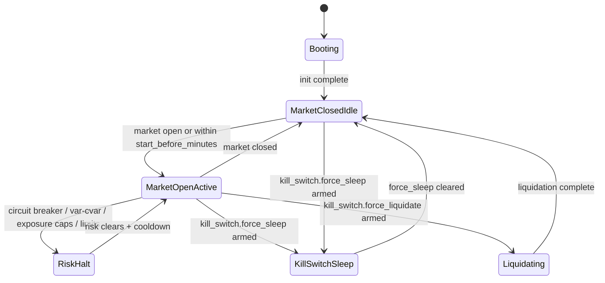
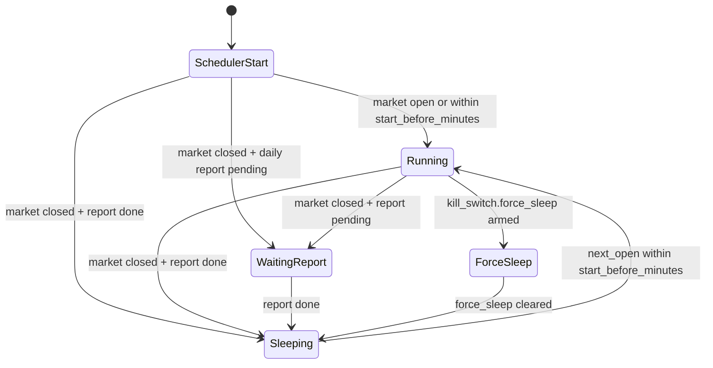
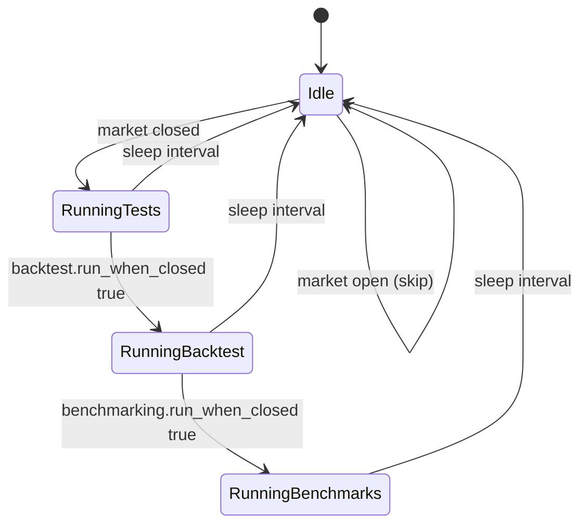
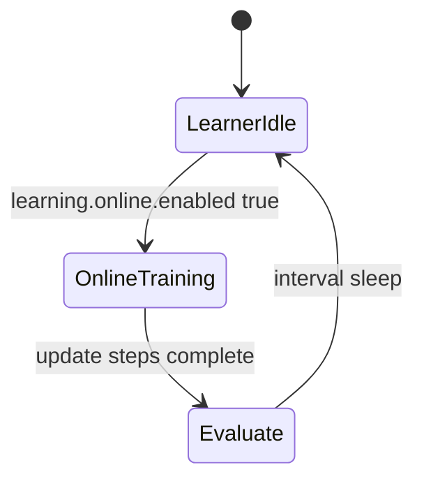

# Agent State Transitions

This document visualizes the runtime modes of the trading agent and supporting
services (tests-when-closed and learner), plus the healthwatch scheduler that
starts/stops services around market hours.

## Trading Agent Runtime

## Healthwatch Market Scheduler

## Tests-When-Closed Service

## Learner Service (Online Updates)

