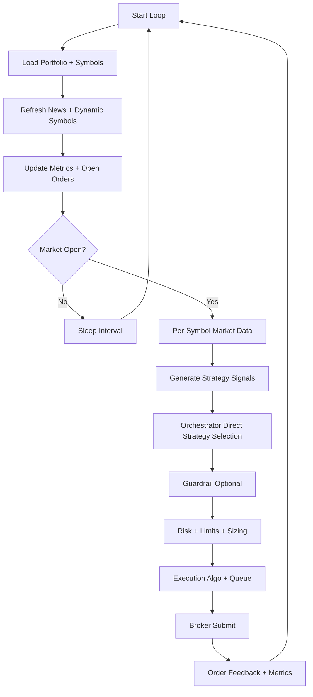
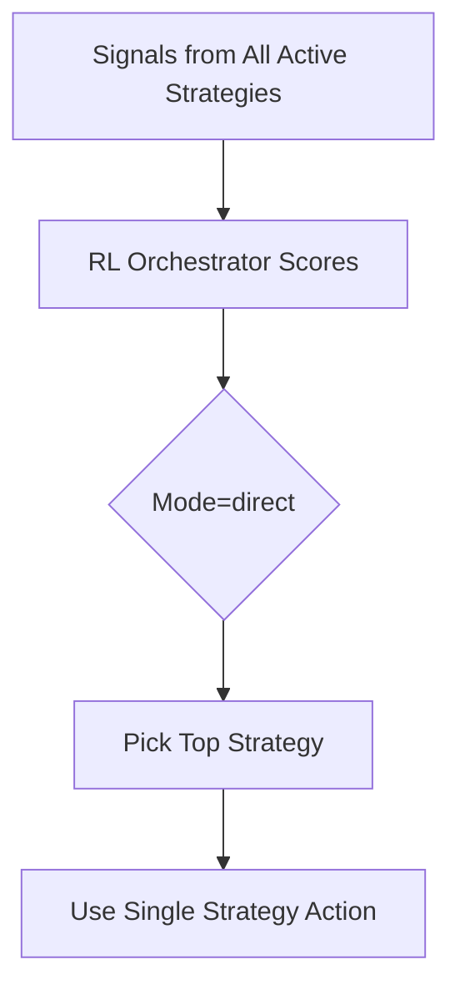
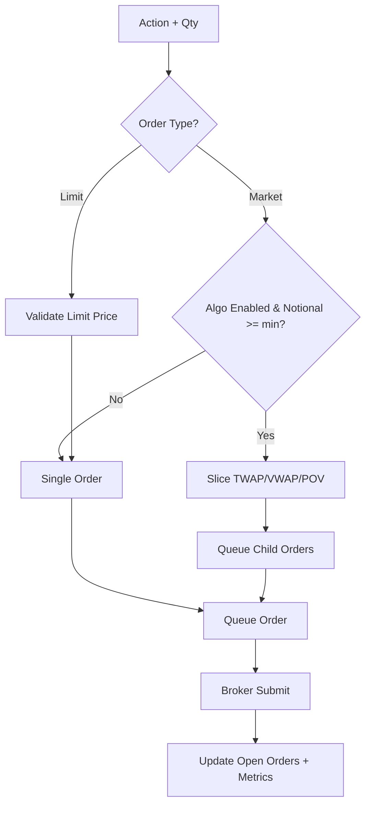
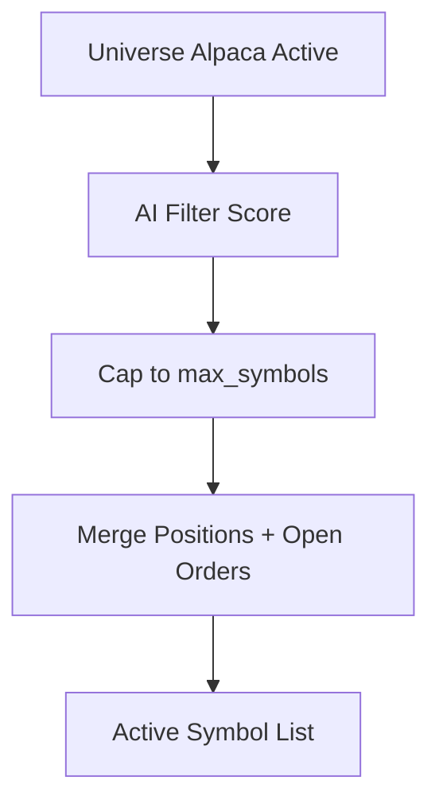

<!-- SPDX-License-Identifier: AGPL-3.0-or-later -->
<!-- Copyright (c) 2025-2026 Nicola Vittorio Francesconi, AKA ilfrick -->

# Trading Agent Flow (v2.0)

This document describes the end-to-end flow for the trading agent in the v2.0 branch.

## Trading Loop (High-Level)

## Orchestrator Decision Path (Direct)

## Execution Path (Market/Limit + Algos)

## Dynamic Symbols (AI Filter)

