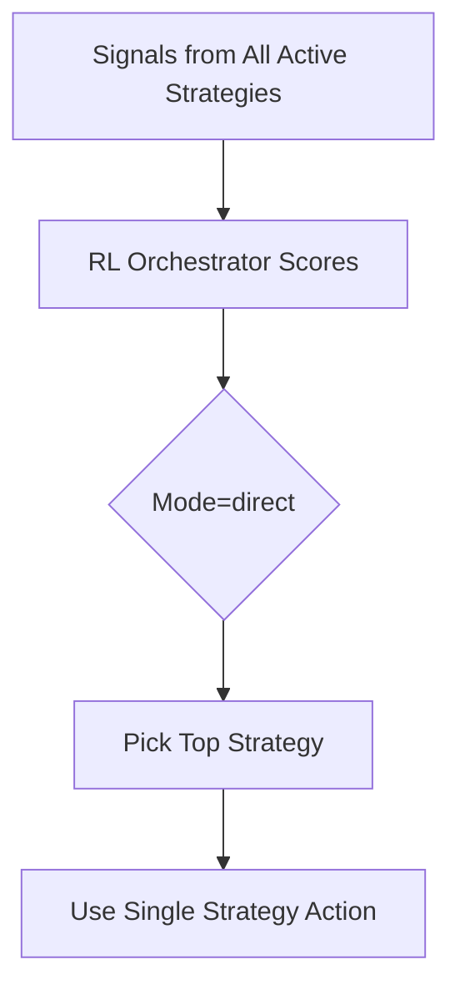
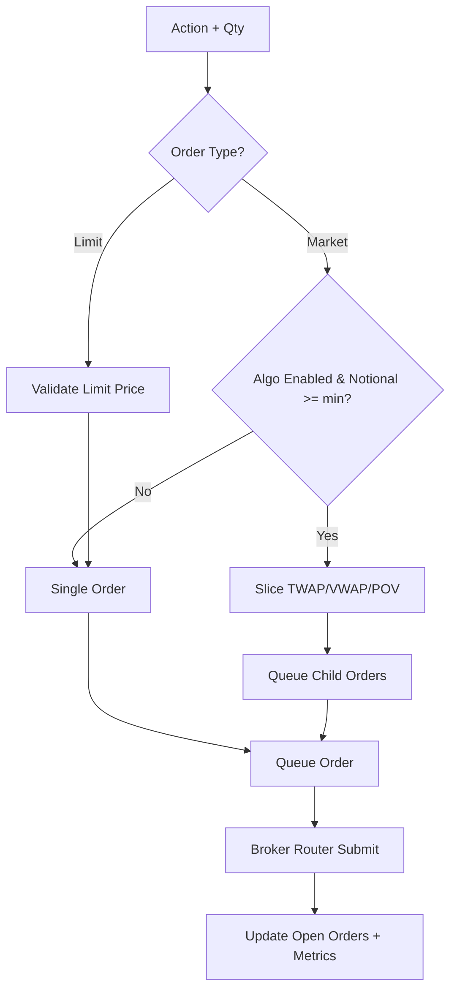

<!-- SPDX-License-Identifier: AGPL-3.0-or-later -->
<!-- Copyright (c) 2025-2026 Nicola Vittorio Francesconi, AKA ilfrick -->

# Trading Agent Flow (master/dev)

This document describes the end-to-end flow for the trading agent in the master/dev branch.

## Trading Loop (High-Level)

```mermaid
flowchart TD
    A[Start Loop] --> B[Load Portfolio + Symbols]
    B --> C[Refresh News + Dynamic Symbols]
    C --> Ollama[Ollama LLM Gate]
    Ollama --> D[Update Metrics + Open Orders]
    D --> E[Read Ops State]
    E --> F{Market Open?}
    F -- No --> G[Sleep Interval]
    G --> A
    F -- Yes --> H[Per-Symbol Market Data (market-cache)]
    H --> I[Generate Strategy Signals + Features]
    I --> J[Drift Monitor + Auto Rollback]
    J --> K[Orchestrator Direct Strategy Selection]
    K --> L[Guardrail Optional]
    L --> AccountFlags[Account Flags + Trading Limits]
    AccountFlags --> M[Risk + VaR/CVaR + Caps<br/>(configurable disable)]
    M --> N[Execution Algo + Queue]
    N --> O[Broker Router Submit]
    O --> P[Order Feedback + Metrics]
    P --> Q[Decision Trace + Audit/Compliance Logs]
    Q --> A
```

## Orchestrator Decision Path (Direct)



## Execution Path (Market/Limit + Algos)



## Dynamic Symbols (AI Filter)

```mermaid
flowchart TD
    A[Universe Broker Active] --> B[AI Filter Score]
    Bars[Market Cache (Redis + file)] --> B
    News[News Catalyst] --> B
    B --> C[Coverage Filter]
    C --> D[Cap to max_symbols]
    D --> E[Merge Positions + Open Orders]
    E --> F[Active Symbol List]
    F --> FilteredCache[Filtered Symbols Cache<br/>(per symbol)]
    FilteredCache --> Bars
```
