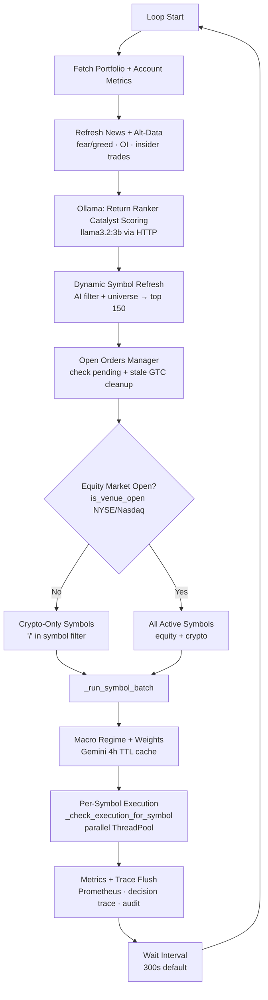
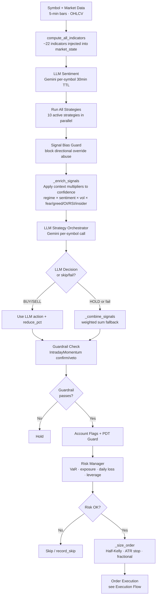
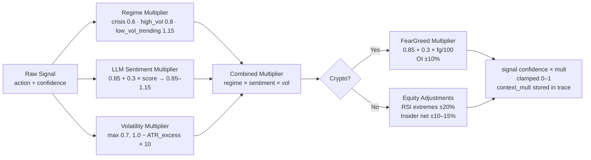
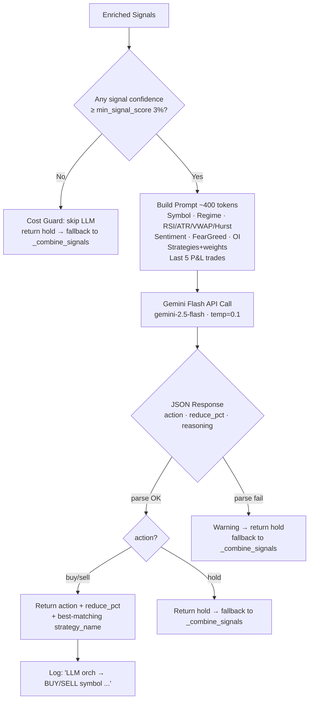
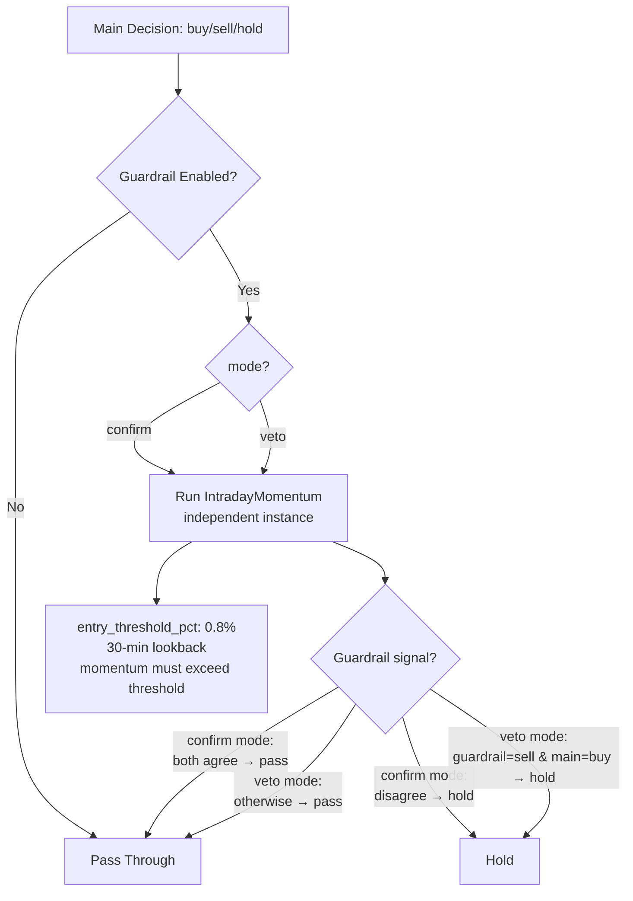
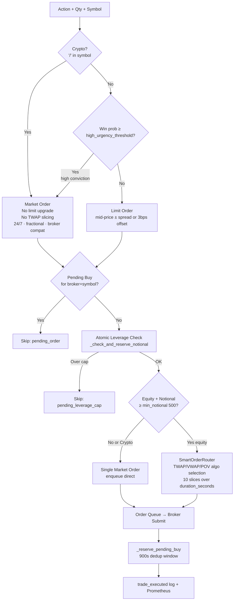
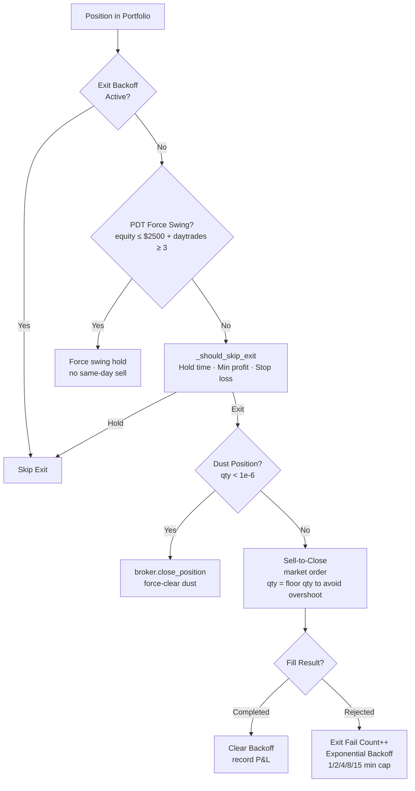
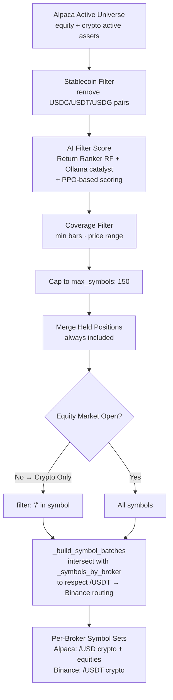

<!-- SPDX-License-Identifier: AGPL-3.0-or-later -->
<!-- Copyright (c) 2025-2026 Nicola Vittorio Francesconi, AKA ilfrick -->

# Trading Agent Flow (v3.0)

This document describes the end-to-end flow for the trading agent as of v3.0.

---

## Main Loop (24/7 Crypto + Equity Market-Hours Gating)

---

## Per-Symbol Execution Flow

---

## Signal Enrichment (_enrich_signals)

Adjusts each strategy's `confidence` in-place before the LLM sees the signals:

---

## LLM Strategy Orchestrator

---

## Guardrail

---

## Execution Flow

---

## Exit Flow

---

## Dynamic Symbol Selection

