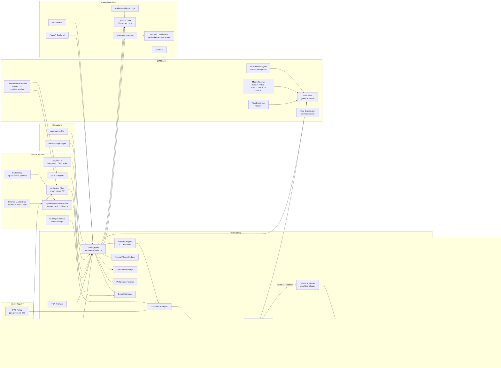

<!-- SPDX-License-Identifier: AGPL-3.0-or-later -->
<!-- Copyright (c) 2025-2026 Nicola Vittorio Francesconi, AKA ilfrick -->

# System Map (v3.0)

## Architecture Diagram

---

## Entrypoints
- `app/main.py`: CLI for `trade`, `backtest`, `download`, `ingest`, `api`, `train`, `online-train`, `evaluate`.
- `docker-compose.yml`: service orchestration — trader, market-cache, redis, api, ollama, learner, tests-when-closed, healthwatch, autoheal, docker-socket-proxy.

---

## Trading Loop (Core Runtime)
- `app/agents/trader.py`: main loop (24/7 crypto + equity market-hours gating); all orchestration.
- `app/agents/symbol_manager.py`: symbol selection, AI filter, venue/sector mapping, stablecoin filter, universe resolution.
- `app/agents/performance.py`: `PerformanceTracker` — trade recording, kill switch.
- `app/agents/open_orders.py`: `OpenOrderManager` — open order cache, pending-order checks.
- `app/agents/account_metrics.py`: `AccountMetricsUpdater` — equity tracking, drawdown, deposit-aware P&L.

---

## Strategies (10 Active)

| Strategy | Asset | Signals |
|---|---|---|
| `trend_following` | equity | Supertrend + VWAP + RSI + regime |
| `factor_model` | equity | Hurst-adaptive + Stochastic/CCI |
| `pattern_trading` | equity | ATR stop + pattern recognition |
| `stat_arb_pairs` | equity | Log-ratio spread + ADF cointegration |
| `top_movers_rf` | equity | Same-day mover nowcast + low-zone entry |
| `crypto_momentum` | crypto | Momentum + volume surge |
| `crypto_mean_reversion` | crypto | Z-score mean reversion |
| `gap_reversal` | equity | Overnight gap reversal |
| `earnings_drift` | equity | PEAD — post-earnings drift |
| `rl_policy` | both | PPO policy (SB3, `ppo_policy.zip`) |

- `app/strategies/confidence_calibrator.py`: bin-based calibration; state persisted across restarts.
- `app/learning/indicators.py`: `compute_all_indicators()` — ~22 indicators injected into `market_state["indicators"]` before strategy calls.

---

## Signal Pipeline (per symbol, per cycle)

1. **compute_all_indicators** → RSI, ATR, VWAP, Hurst, Stochastic, Supertrend, etc.
2. **LLM Sentiment** (Gemini, 30-min TTL) → `market_state["llm_sentiment"]`
3. **Run strategies** in parallel → `signals: list[dict]` (action, confidence, name, ...)
4. **Confidence calibration** → calibrated_confidence per signal
5. **Signal bias guard** → block directional override abuse
6. **`_enrich_signals`** → multiply confidence by regime × sentiment × vol × crypto-alt-data multipliers; add `context_mult` to trace
7. **`update_signals()`** → accumulate enriched signals into `LLMPortfolioOrchestrator` buffer (thread-safe)
8. **`get_decision()`** → apply cached portfolio-level decision from previous cycle; fallback to `_combine_signals()` if hold/miss
9. *(After full batch)* **`run_portfolio_cycle()`** → ONE Gemini call with all symbols visible → updates decision cache for next cycle

---

## LLM Layer

- `app/llm/client.py`: `LLMClient` — unified backend (ClaudeBackend, GeminiBackend); daily $5 budget circuit breaker; retry with backoff; per-call `model` override.
- `app/llm/portfolio_orchestrator.py`: **`LLMPortfolioOrchestrator`** (active) — accumulates signals from all symbols per cycle via `update_signals()`, then fires ONE Gemini call (`run_portfolio_cycle()`) with the full cross-symbol picture (regime, indicators, alt-data, signals, portfolio state, P&L history). Returns buy/sell/hold for each symbol. Decisions cached for the next cycle; falls back to `_combine_signals()` on skip/fail.
- `app/llm/strategy_orchestrator.py`: `LLMStrategyOrchestrator` (available, mode `per_symbol`) — per-symbol Gemini call; disabled when `mode: portfolio`.
- `app/llm/sentiment.py`: per-symbol news sentiment scoring (Gemini, 30-min TTL).
- `app/llm/macro_regime.py`: 5-regime classification using FRED VIX/DGS10/DXY (Gemini, 4h TTL).
- `app/llm/risk_interpreter.py`: Gemini-based risk commentary.
- `app/llm/meta_orchestrator.py`: session-level meta decisions (disabled — needs ≥3 session reports).
- **Ollama** (`http://ollama:11434`, `llama3.2:3b`): local return ranker for catalyst flag scoring in AI filter; ~500ms latency.

---

## Risk

- `app/risk/manager.py`: exposure caps, leverage, daily loss (deposit-aware), per-symbol circuit breaker (5% drawdown), VaR/CVaR.
- `app/risk/config.py`: `RiskConfig` dataclass.
- `app/risk/haircut.py`: stress/liquidity haircuts.
- PDT guard: `_would_trigger_pdt_swing()` — equity only; equity ≤ $2,500; daytrades ≥ 3.
- Pending dedup: `_pending_buy_symbols` per (broker, symbol) — 900s window; `_pending_notional` atomic reserve.
- Stuck cooldown: `_stuck_cooldown` (15 min) + `_symbol_stuck_blacklist` (1h after 2 consecutive timeouts).
- Position exit guards (in `_check_position_exit`): minimum hold time (`strategy.params.min_hold_minutes`); ATR stop (2.5× crypto / 1.5× equity); hard stop / trailing stop / take-profit read from `risk.crypto.*` for crypto symbols, flat `risk.*` for equities.

---

## Execution

- `app/execution/smart_router.py`: `SmartOrderRouter` — TWAP/VWAP/POV/market based on urgency, spread, volatility, notional. **Bypassed for crypto** (single market order always).
- `app/execution/algos.py`: `twap_slices`, `vwap_slices`, `pov_slices`, `adaptive_slices` (regime-aware), `fractional_slice`.
- `app/execution/order_queue.py`: FIFO queue + feedback loop; `enqueue()` returns `"queued"` sentinel when heap-queued but not yet started.
- `app/execution/tca.py`: `TCAAnalyzer` — slippage/impact measurement.
- `app/portfolio/optimizer.py`: `PortfolioOptimizer` — risk parity sizing via covariance.
- Limit orders: auto-upgrade market→limit at mid-price ± spread/3bps; skipped for crypto and high-confidence signals.

---

## Data & Alt-Data

- `app/data/alt_data.py`: fear/greed index (alternative.me), CoinGlass OI change %, SEC EDGAR insider net sentiment; TTL-cached.
- `app/data/ai_filter.py`: AI symbol scorer; uses Ollama catalyst flag + return ranker RF; provides `score_symbols()`.
- `app/data/news.py`: broker-backed news/catalyst fetch → raw articles → `_combined_news_fetch()`.
- `app/data/earnings_calendar.py`: Alpha Vantage earnings calendar for `EarningsDriftStrategy`.
- `app/data/binance_market_data.py`: `fetch_binance_bars()` + `BinanceMarketDataProvider`; merged via `_HybridMarketDataProvider` in `app/main.py` to route /USDT symbols to Binance, others to Alpaca.

---

## Brokers

- `app/brokers/alpaca.py`: `AlpacaBroker` — equities + /USD crypto; fractional shares; `asset_class` enum-safe check; min notional $10; `quote_stream` disabled.
- `app/brokers/binance.py`: `BinanceBroker` — /USDT crypto; spot + futures demo; `client.transfer_dust()` for sub-lot-step balances; `_spot_account()` equity includes marked-to-market holdings.
- `app/brokers/ibkr.py`: `IBKRBroker` — equities.
- `app/brokers/router.py`: `BrokerRouter` — multi-broker fan-out + per-broker state.
- `app/utils/market.py`: `is_market_open()`, `is_venue_open()`, `next_market_open()`.

---

## Learning

- `app/learning/train_rl.py`: offline PPO training.
- `app/learning/online_update.py`: online PPO updates.
- `app/learning/env.py`: Gymnasium environment; `app/learning/features.py`: observation construction.
- `app/learning/registry.py`: model registry + active pointer.
- `app/learning/drift.py`: feature/PnL drift detection.
- `scripts/collect_return_ranker_data.py` + `scripts/collect_crypto_training_data.py`: data collection.

---

## Monitoring and Ops

- `app/monitoring/metrics.py`: Prometheus metrics (TRADES, ORDER_LATENCY, RISK_BLOCKS, etc.).
- `app/monitoring/healthwatch.py`: health scheduler + ops state file (`config/restart.flag`).
- `app/monitoring/audit.py`: audit/compliance JSONL logging.
- Grafana: `grafana/provisioning/dashboards/` — per-broker dashboards auto-generated from `.env` by `scripts/generate_grafana_dashboards.py`.
- Decision trace: `data/traces/decisions_*.jsonl` — per-cycle per-symbol JSON records including `context_mult`, `effective_weights`, `orchestrator_weights`.

---

## API and Configuration

- `app/api/server.py`: FastAPI config UI, schema validation, restart trigger.
- `config/config.yaml`: all runtime config; supports `${ENV_VAR}` interpolation. Key sections: `strategy`, `risk`, `execution`, `llm_orchestrator`, `market`, `data`.
