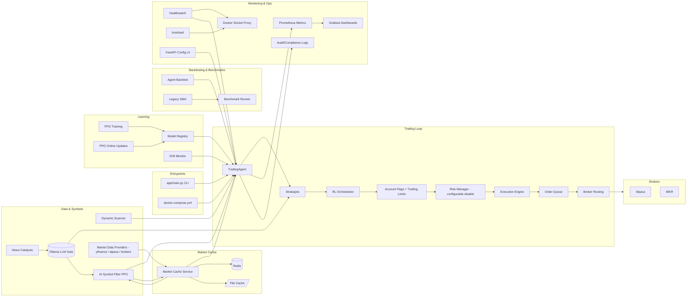

<!-- SPDX-License-Identifier: AGPL-3.0-or-later -->
<!-- Copyright (c) 2025-2026 Nicola Vittorio Francesconi, AKA ilfrick -->

# System Map

## Architecture Diagram

## Entrypoints
- `app/main.py`: CLI entrypoint for `trade`, `backtest`, `download`, `ingest`, `api`, `train`, `online-train`, `evaluate`, `pretrain-orchestrator`.
- `docker-compose.yml`: service orchestration (trader, market-cache, redis, api, learner, tests-when-closed, healthwatch, autoheal, docker-socket-proxy, etc).

## Trading Loop (Core Runtime)
- `app/agents/trader.py`: main loop orchestration; delegates to extracted modules below.
- `app/agents/symbol_manager.py`: symbol selection, AI filter integration, venue/sector mapping, universe resolution.
- `app/agents/performance.py`: `PerformanceTracker` — trade recording, stats computation, kill switch.
- `app/agents/open_orders.py`: `OpenOrderManager` — open order cache, pending-order checks, metrics.
- `app/agents/account_metrics.py`: `AccountMetricsUpdater` — equity tracking, drawdown, VaR/CVaR.
- `app/utils/structured_log.py`: `StructuredLogger` — structured JSON logging for trade/risk events.
- `app/utils/volatility.py`: shared realized volatility calculation.
- `app/utils/account.py`: `extract_equity_cash()` — shared equity/cash/buying-power extraction for Alpaca and IBKR formats.
- Flow: symbols -> market data -> strategies -> orchestrator -> risk -> execution -> metrics/logging.

## Strategies
- `app/strategies/`: signal generators.
  - **Active**: `trend_following` (RSI + volume filter), `factor_model` (mean-reversion + trend quality), `pattern_trading` (ATR stop), `stat_arb_pairs` (z-score spread).
  - **Inactive**: `rl_policy`, `rl_policy_fees`, `intraday_momentum`, `market_maker`.
- `app/strategies/base.py`: strategy interface.
- `app/learning/indicators.py`: shared technical indicators (ATR, Bollinger, stochastic, etc.).

## Orchestrator
- `app/agents/orchestrator.py`: RL policy-gradient selector over strategy signals; uses AI filter
  features and order feedback; online updates + pretraining.

## Risk
- `app/risk/manager.py`: core limits (exposure, leverage, daily loss with configurable timezone), cooldown checks, order limits, exposure caps.
- `app/risk/config.py`: `RiskConfig` dataclass — typed risk configuration with `from_dict`/`to_dict`.
- `app/risk/haircut.py`: stress/liquidity haircuts.
- `risk.enabled: false` bypasses risk checks, but broker account flags and trading limits still block orders.
- Risk gating is integrated in `app/agents/trader.py`.

## Execution
- `app/execution/executor.py`: broker-agnostic order placement.
- `app/execution/order_queue.py`: FIFO queue and feedback loop.
- `app/execution/routing.py`: multi-broker routing logic.
- `app/brokers/`: Alpaca/IBKR adapters + router.

## Data and Market State
- `app/data/downloader.py`: yfinance historical download.
- `app/data/ingestion.py`: ingestion from yfinance/alpaca/stooq/alphavantage.
- `app/data/scanner.py`: symbol universe and price filter (Alpaca snapshots).
- `app/data/ai_filter.py`: PPO-based symbol scorer with optional Keras returns overlay and online updates; provider selects alpaca or yfinance bars.
- `app/data/news.py`: broker-backed news/catalyst fetch.
- `Ollama`: Local LLM gate for processing news catalysts.
- `app/data/market_cache.py`: Redis + file cache client for live yfinance bars and filtered symbols.
- `app/data/market_cache_service.py`: cache service that refreshes bars on the interval cadence.

## Learning (Trading Policy)
- `app/learning/train_rl.py`: offline PPO training.
- `app/learning/online_update.py`: online PPO updates.
- `app/learning/evaluate.py`: evaluation.
- `app/learning/env.py`: Gymnasium environment.
- `app/learning/features.py`: observation construction.
- `app/learning/registry.py`: model registry + active pointer.
- `app/learning/drift.py`: feature/PnL drift detection.

## Backtesting and Benchmarking
- `app/backtest/agent_engine.py`: agent-aligned backtests (real loop).
- `app/backtest/engine.py`: legacy SMA backtest.
- `scripts/benchmark_runner.py`: benchmark suite and scenarios.

## Monitoring and Ops
- `app/monitoring/metrics.py`: Prometheus metrics.
- `app/monitoring/healthwatch.py`: health scheduler + ops state file.
- `app/monitoring/audit.py`: audit/compliance logging.
- Grafana dashboards: `grafana/provisioning/dashboards/*.json` (per-account dashboards auto-generated from `.env` by `scripts/generate_grafana_dashboards.py`).
- Prometheus config: `prometheus/prometheus.yml` + `prometheus/alerts.yml`.

## API and UI
- `app/api/server.py`: FastAPI config UI, schema, restart trigger.

## Configuration
- `config/config.yaml`: all runtime config; supports `${ENV_VAR}` interpolation.
